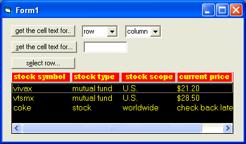



## ListGrid control  a lightweight  FlexGrid replacement that's cross between listbox \+ flexgrid

### Description

This extends the functionality of the listbox by (1) allowing you to create an attractive header with 3 styles ( sunken, framed, raised) (2) specify a header backcolor, forecolor and font.. as well as the fore and backcolor and font of the list portion of the control. The best part of this control is that is specifically designed to be a listbox with tabstops AND you can retrieve AND set data in the list based upon a row and column setting...so all the dirty working of juggling text data is taken care of.

This is something i whipped together in a couple of hours so its not totally complete..but its pretty much there..and I am hoping to get suggestions from you on how to enhance and refine it..but I am pretty sure you will like and appreciate it!!
 
### More Info
 

             |
---                |---
**Submitted On**   |2005-02-04 02:35:30
**By**             |[Evan Toder](https://github.com/Planet-Source-Code/PSCIndex/blob/master/ByAuthor/evan-toder.md)
**Level**          |Intermediate
**User Rating**    |4.8 (29 globes from 6 users)
**Compatibility**  |VB 3\.0, VB 4\.0 \(16\-bit\), VB 4\.0 \(32\-bit\), VB 5\.0, VB 6\.0
**Category**       |[Custom Controls/ Forms/  Menus](https://github.com/Planet-Source-Code/PSCIndex/blob/master/ByCategory/custom-controls-forms-menus__1-4.md)
**World**          |[Visual Basic](https://github.com/Planet-Source-Code/PSCIndex/blob/master/ByWorld/visual-basic.md)
**Archive File**   |[ListGrid\_c184808242005\.zip](https://github.com/Planet-Source-Code/evan-toder-listgrid-control-a-lightweight-flexgrid-replacement-that-s-cross-between-listbo__1-58683/archive/master.zip)

